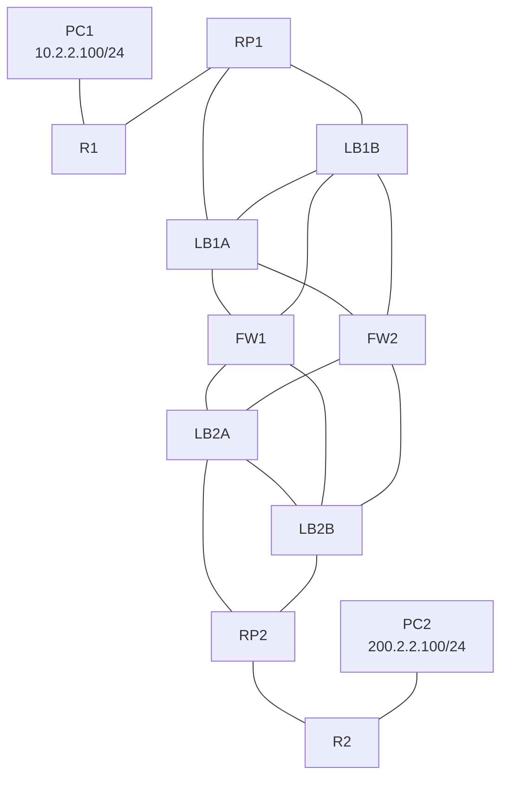

>[!NOTE]
>RESET:
>```
>sudo cp /opt/vyatta/etc/config.boot.default /config/config.boot
>```


PC1 (Computer)
```
set pcname PC1
ip 10.2.2.100 255.255.255.0
```

PC2 (Computer)
```
set pcname PC2
ip 200.2.2.100 255.255.255.0
```

R1 (Router)
```
configure t
interface f0/0
ip addr 10.1.1.10 255.255.255.0
no shutdown
interface f0/1
ip addr 10.2.2.10 255.255.255.0
no shutdown

ip route 0.0.0.0 0.0.0.0 10.1.1.1
ip route 200.1.1.0 255.255.255.0 10.3.3.10
ip route 200.1.1.0 255.255.255.0 10.4.4.10

end
write
```

R2 (Router)
```
configure t
interface f0/0
ip addr 200.1.1.10 255.255.255.0
no shutdown
interface f0/1
ip addr 200.2.2.10 255.255.255.0
no shutdown

ip route 10.2.2.0 255.255.255.0 200.3.3.10
ip route 10.2.2.0 255.255.255.0 200.4.4.10

end
write
```

LB1A (Load Balancer)
```
configure
set system host-name LB1A
# Set interfaces
set interfaces ethernet eth0 address 10.3.3.10/24  
set interfaces ethernet eth1 address 10.3.3.20/24  
set interfaces ethernet eth2 address 10.3.3.30/24
set interfaces ethernet eth3 address 10.3.3.40/24

# Static Routes
set protocols static route 10.2.2.0/24 next-hop 10.1.1.10
set protocols static route 0.0.0.0/24 next-hop 100.1.1.40
set protocols static route 0.0.0.0/24 next-hop 250.2.2.30

# vrrp
set high-availability vrrp group LB1Cluster vrid 10  
set high-availability vrrp group LB1Cluster interface eth1
set high-availability vrrp group LB1Cluster virtual-address 192.168.100.1/24 
set high-availability vrrp sync-group LB1Cluster member LB1Cluster  
set high-availability vrrp group LB1Cluster rfc3768-compatibility

# conntrack sinc
set service conntrack-sync accept-protocol 'tcp,udp,icmp'  
set service conntrack-sync failover-mechanism vrrp sync-group LB1Cluster  
set service conntrack-sync interface eth1  
set service conntrack-sync mcast-group 225.0.0.50  
set service conntrack-sync disable-external-cache

# load balancing
set load-balancing wan interface-health eth2 nexthop 10.3.3.30 
set load-balancing wan interface-health eth3 nexthop 100.1.1.40
set load-balancing wan rule 1 inbound-interface eth0
set load-balancing wan rule 1 interface eth2 weight 1
set load-balancing wan rule 1 interface eth3 weight 1
set load-balancing wan rule 2 inbound-interface eth1
set load-balancing wan rule 2 interface eth2 weight 1
set load-balancing wan rule 2 interface eth3 weight 1
set load-balancing wan sticky-connections inbound  
set load-balancing wan disable-source-nat

commit
save
exit
```

LB1B (Load Balancer)
```
configure
set system host-name LB1B
# Set interfaces
set interfaces ethernet eth0 address 10.4.4.10/24  
set interfaces ethernet eth1 address 10.4.4.20/24  
set interfaces ethernet eth2 address 10.4.4.30/24
set interfaces ethernet eth3 address 10.4.4.40/24

# Static Routes
set protocols static route 10.2.2.0/24 next-hop 10.1.1.10
set protocols static route 0.0.0.0/24 next-hop 100.2.2.30
set protocols static route 0.0.0.0/24 next-hop 250.1.1.40

# vrrp
set high-availability vrrp group LB1Cluster vrid 10  
set high-availability vrrp group LB1Cluster interface eth1
set high-availability vrrp group LB1Cluster virtual-address 192.168.100.1/24 
set high-availability vrrp sync-group LB1Cluster member LB1Cluster  
set high-availability vrrp group LB1Cluster rfc3768-compatibility

# conntrack sinc
set service conntrack-sync accept-protocol 'tcp,udp,icmp'  
set service conntrack-sync failover-mechanism vrrp sync-group LB1Cluster  
set service conntrack-sync interface eth1  
set service conntrack-sync mcast-group 225.0.0.50  
set service conntrack-sync disable-external-cache

# load balancing
set load-balancing wan interface-health eth2 nexthop 100.2.2.30
set load-balancing wan interface-health eth3 nexthop 250.1.1.40
set load-balancing wan rule 1 inbound-interface eth0
set load-balancing wan rule 1 interface eth2 weight 1
set load-balancing wan rule 1 interface eth3 weight 1
set load-balancing wan rule 2 inbound-interface eth1
set load-balancing wan rule 2 interface eth2 weight 1
set load-balancing wan rule 2 interface eth3 weight 1
set load-balancing wan sticky-connections inbound  
set load-balancing wan disable-source-nat

commit  
save
exit
```

LB2A (Load Balancer)
```
configure
set system host-name LB2A
# Set interfaces
set interfaces ethernet eth0 address 200.3.3.40/24 
set interfaces ethernet eth1 address 200.3.3.30/24  
set interfaces ethernet eth2 address 200.3.3.20/24
set interfaces ethernet eth3 address 200.3.3.10/24

# Static Routes
set protocols static route 0.0.0.0/24 next-hop 200.1.1.10
set protocols static route 10.2.2.0/24 next-hop 100.4.4.40
set protocols static route 10.2.2.0/24 next-hop 250.3.3.30

# vrrp
set high-availability vrrp group LB2Cluster vrid 10  
set high-availability vrrp group LB2Cluster interface eth1
set high-availability vrrp group LB2Cluster virtual-address 192.168.100.2/24 
set high-availability vrrp sync-group LB2Cluster member LB2Cluster  
set high-availability vrrp group LB2Cluster rfc3768-compatibility

# conntrack sinc
set service conntrack-sync accept-protocol 'tcp,udp,icmp'  
set service conntrack-sync failover-mechanism vrrp sync-group LB2Cluster  
set service conntrack-sync interface eth2  
set service conntrack-sync mcast-group 225.0.0.50  
set service conntrack-sync disable-external-cache

# load balancing
set load-balancing wan interface-health eth0 nexthop 100.4.4.40
set load-balancing wan interface-health eth1 nexthop 250.3.3.30
set load-balancing wan rule 1 inbound-interface eth2
set load-balancing wan rule 1 interface eth0 weight 1
set load-balancing wan rule 1 interface eth1 weight 1
set load-balancing wan rule 2 inbound-interface eth3
set load-balancing wan rule 2 interface eth0 weight 1
set load-balancing wan rule 2 interface eth1 weight 1
set load-balancing wan sticky-connections inbound  
set load-balancing wan disable-source-nat 

commit  
save
exit
```

LB2B (Load Balancer)
```
configure
set system host-name LB2B
# Set interfaces
set interfaces ethernet eth0 address 200.4.4.40/24 
set interfaces ethernet eth1 address 200.4.4.30/24  
set interfaces ethernet eth2 address 200.4.4.20/24
set interfaces ethernet eth3 address 200.4.4.10/24

# Static Routes
set protocols static route 0.0.0.0/24 next-hop 200.1.1.10
set protocols static route 10.2.2.0/24 next-hop 100.3.3.30
set protocols static route 10.2.2.0/24 next-hop 250.4.4.40

# vrrp
set high-availability vrrp group LB2Cluster vrid 10  
set high-availability vrrp group LB2Cluster interface eth1
set high-availability vrrp group LB2Cluster virtual-address 192.168.100.2/24 
set high-availability vrrp sync-group LB2Cluster member LB2Cluster  
set high-availability vrrp group LB2Cluster rfc3768-compatibility

# conntrack sinc
set service conntrack-sync accept-protocol 'tcp,udp,icmp'  
set service conntrack-sync failover-mechanism vrrp sync-group LB2Cluster  
set service conntrack-sync interface eth2  
set service conntrack-sync mcast-group 225.0.0.50  
set service conntrack-sync disable-external-cache

# load balancing
set load-balancing wan interface-health eth0 nexthop 250.4.4.40
set load-balancing wan interface-health eth1 nexthop 100.3.3.30
set load-balancing wan rule 1 inbound-interface eth2
set load-balancing wan rule 1 interface eth0 weight 1
set load-balancing wan rule 1 interface eth1 weight 1
set load-balancing wan rule 2 inbound-interface eth3
set load-balancing wan rule 2 interface eth0 weight 1
set load-balancing wan rule 2 interface eth1 weight 1
set load-balancing wan sticky-connections inbound  
set load-balancing wan disable-source-nat

commit  
save
exit
```

FW1 (Firewall)
```
configure
set system host-name FW1
# Set interfaces
set interfaces ethernet eth0 address 100.4.4.40/24 
set interfaces ethernet eth1 address 100.3.3.30/24 
set interfaces ethernet eth2 address 100.2.2.30/24
set interfaces ethernet eth3 address 100.1.1.40/24

# Static Routes
set protocols static route 10.2.2.0/24 next-hop 10.3.3.40
set protocols static route 10.2.2.0/24 next-hop 10.4.4.30
set protocols static route 0.0.0.0/24 next-hop 200.4.4.30
set protocols static route 0.0.0.0/24 next-hop 200.3.3.40

# nat/pat
set nat source rule 10 outbound-interface eth0
set nat source rule 10 source address 10.0.0.0/8  
set nat source rule 10 translation address 192.1.0.1-192.1.0.10
set nat source rule 11 outbound-interface eth1
set nat source rule 11 source address 10.0.0.0/8  
set nat source rule 11 translation address 192.1.0.1-192.1.0.10

commit  
save
exit
```

FW2 (Firewall)
```
configure
set system host-name FW2
# Set interfaces
set interfaces ethernet eth0 address 250.4.4.40/24
set interfaces ethernet eth1 address 250.3.3.30/24  
set interfaces ethernet eth2 address 250.2.2.30/24
set interfaces ethernet eth3 address 250.1.1.40/24

# Static Routes
set protocols static route 10.2.2.0/24 next-hop 10.3.3.30
set protocols static route 10.2.2.0/24 next-hop 10.4.4.40
set protocols static route 0.0.0.0/24 next-hop 200.4.4.40
set protocols static route 0.0.0.0/24 next-hop 200.3.3.30

# nat/pat
set nat source rule 10 outbound-interface eth0
set nat source rule 10 source address 10.0.0.0/8  
set nat source rule 10 translation address 192.1.0.1-192.1.0.10
set nat source rule 11 outbound-interface eth1
set nat source rule 11 source address 10.0.0.0/8  
set nat source rule 11 translation address 192.1.0.1-192.1.0.10

commit  
save
exit
```
