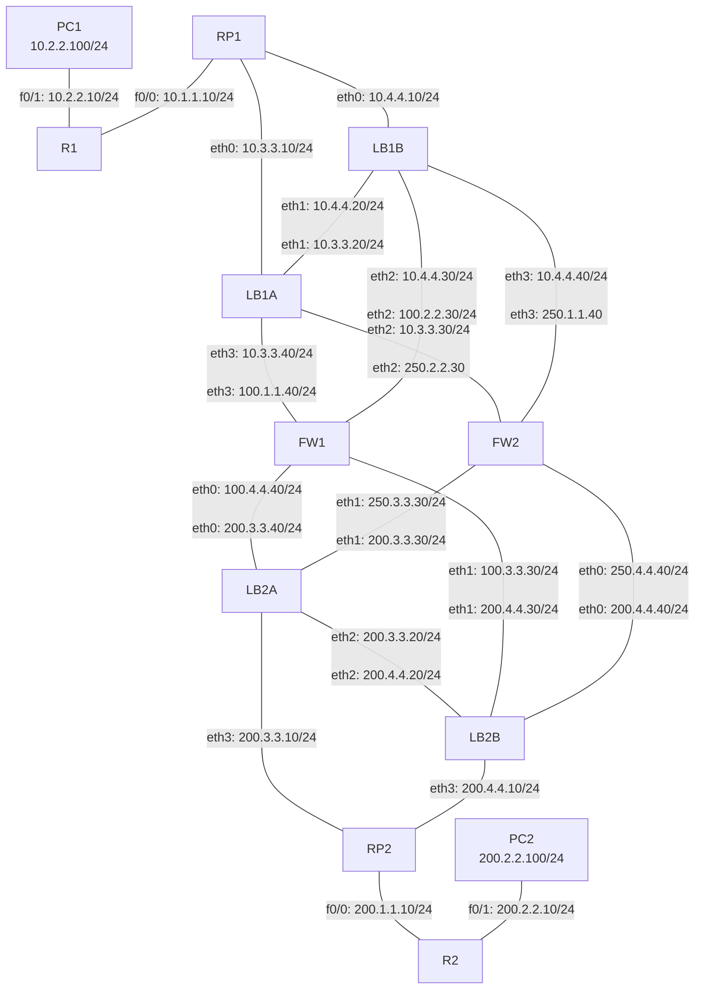

```mermaid
graph TD
    A[PC1\n10.2.2.100/24]        --- |f0/1: 10.2.2.10/24| B[R1]
    C[RP1]                       --- |f0/0: 10.1.1.10/24| B[R1]
    C[RP1]                       --- |eth0: 10.3.3.10/24| D[LB1A]
    C[RP1]                       --- |eth0: 10.4.4.10/24| E[LB1B]
    E[LB1B]                      --- |eth1: 10.4.4.20/24\n\neth1: 10.3.3.20/24| D[LB1A]
    I[LB2A]                      --- |eth3: 200.3.3.10/24| K[RP2]
    J[LB2B]                      --- |eth3: 200.4.4.10/24| K[RP2]
    I[LB2A]                      --- |eth2: 200.3.3.20/24\n\neth2: 200.4.4.20/24| J[LB2B]
    D[LB1A]                      --- |eth3: 10.3.3.40/24\n\neth3: 100.1.1.40/24| G[FW1]
    D[LB1A]                      --- |eth2: 10.3.3.30/24\n\neth2: 250.2.2.30| H[FW2]
    E[LB1B]                      --- |eth3: 10.4.4.40/24\n\neth3: 250.1.1.40| H[FW2]
    E[LB1B]                      --- |eth2: 10.4.4.30/24\n\neth2: 100.2.2.30/24| G[FW1]
    G[FW1]                       --- |eth0: 100.4.4.40/24\n\neth0: 200.3.3.40/24 | I[LB2A]
    G[FW1]                       --- |eth1: 100.3.3.30/24\n\neth1: 200.4.4.30/24 | J[LB2B]
    H[FW2]                       --- |eth0: 250.4.4.40/24\n\neth0: 200.4.4.40/24 | J[LB2B]
    H[FW2]                       --- |eth1: 250.3.3.30/24\n\neth1: 200.3.3.30/24 | I[LB2A]
    K[RP2]                       --- |f0/0: 200.1.1.10/24| L[R2]
    M[PC2\n200.2.2.100/24]       --- |f0/1: 200.2.2.10/24| L[R2]
```

![[topology.png]]

